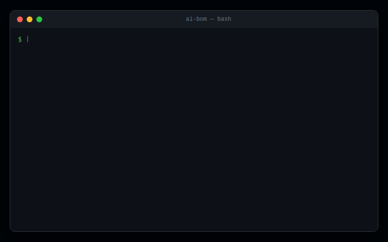

<div align="center">
  
  <h1>AI-BOM</h1>
  <p><strong>Discover every AI agent, model, and API hiding in your infrastructure</strong></p>

  <p>
    <a href="#quick-start">Quick Start</a> &nbsp;|&nbsp;
    <a href="#what-it-finds">What It Finds</a> &nbsp;|&nbsp;
    <a href="#demo">Demo</a> &nbsp;|&nbsp;
    <a href="#output-formats">Output Formats</a> &nbsp;|&nbsp;
    <a href="#n8n-workflow-scanning-first-of-its-kind">n8n Scanning</a> &nbsp;|&nbsp;
    <a href="#risk-scoring">Risk Scoring</a>
  </p>

  <!-- badges -->
  <p>
    
    
    
    
    
  </p>
</div>

---

<div align="center">
  
  <br />
  <sub>Scan your entire infrastructure in seconds</sub>
</div>

---

## Why AI-BOM?


Shadow AI is the new Shadow IT. Developers are integrating AI services — LLMs, agents, embeddings, MCP servers — without security review. Organizations face real compliance gaps:

- **EU AI Act (Article 53, Aug 2025)** — requires a complete AI component inventory
- **NIST AI Agent Security (Jan 2026)** — mandates agent trust boundaries
- **60%+ of AI usage is undocumented** — shadow AI is everywhere
- **No existing tool scans n8n workflows for AI** — until now

**ai-bom** is a single CLI that scans source code, Docker configs, cloud infrastructure, network endpoints, and n8n workflows — then produces a standards-compliant AI Bill of Materials.

**One command. Complete visibility.**

<br clear="right" />

## Quick Start

```bash
pip install ai-bom

ai-bom scan .

ai-bom scan . --format cyclonedx --output ai-bom.json
```

## What It Finds

| Category | Examples | Scanner |
|----------|----------|---------|
| LLM Providers | OpenAI, Anthropic, Google AI, Mistral, Cohere, Ollama | Code |
| Agent Frameworks | LangChain, CrewAI, AutoGen, LlamaIndex, LangGraph | Code |
| Model References | gpt-4o, claude-3-5-sonnet, gemini-1.5-pro, llama-3 | Code |
| API Keys | OpenAI (sk-\*), Anthropic (sk-ant-\*), HuggingFace (hf\_\*) | Code, Network |
| AI Containers | Ollama, vLLM, HuggingFace, NVIDIA, ChromaDB | Docker |
| Cloud AI | AWS Bedrock, SageMaker, Vertex AI, Azure Cognitive | Cloud |
| AI Endpoints | api.openai.com, api.anthropic.com, localhost:11434 | Network |
| n8n AI Nodes | AI Agents, LLM Chat, MCP Client, Tools, Embeddings | n8n |
| MCP Servers | Model Context Protocol connections | Code, n8n |

**21+ AI SDKs detected** across Python, JavaScript, TypeScript, Java, Go, Rust, and Ruby.

## Demo

```bash
ai-bom demo
```

Runs a scan on the bundled demo project showcasing all detection capabilities:

```
━━━━━━━━━━━━━━━━━━━━━━━━━━━━━━━━━━━━━━━━━━━━━━━━━━━━
  AI-BOM Discovery Scanner by Trusera
━━━━━━━━━━━━━━━━━━━━━━━━━━━━━━━━━━━━━━━━━━━━━━━━━━━━

✓ Running code scanner...       done
✓ Running docker scanner...     done
✓ Running network scanner...    done
✓ Running cloud scanner...      done
✓ Running n8n scanner...        done

Found 40 AI/LLM component(s)

┌──────────────────────┬────────────────────┬──────┬──────────┐
│ Component            │ Type               │ Risk │ Severity │
├──────────────────────┼────────────────────┼──────┼──────────┤
│ OpenAI SDK           │ LLM Provider       │   30 │ CRITICAL │
│ Anthropic SDK        │ LLM Provider       │   25 │ HIGH     │
│ LangChain            │ Agent Framework    │   20 │ HIGH     │
│ gpt-4o               │ Model Reference    │   15 │ MEDIUM   │
│ AI Agent Node        │ n8n AI Node        │   30 │ CRITICAL │
│ MCP Client           │ n8n MCP            │   25 │ HIGH     │
│ Ollama Container     │ AI Container       │   10 │ MEDIUM   │
│ ...                  │                    │      │          │
└──────────────────────┴────────────────────┴──────┴──────────┘
```

## Output Formats

### Table (default)

```bash
ai-bom scan .
```

Rich terminal output with color-coded risk levels, severity badges, and component grouping.

### CycloneDX 1.6

```bash
ai-bom scan . --format cyclonedx --output ai-bom.cdx.json
```

Industry-standard SBOM format compatible with OWASP Dependency-Track and other SBOM tools. Includes Trusera-specific properties for AI risk metadata.

### HTML Dashboard

```bash
ai-bom scan . --format html --output report.html
```

Self-contained dark-mode dashboard with sortable tables, severity charts, and risk breakdowns. Share with stakeholders — no server required.

### Markdown

```bash
ai-bom scan . --format markdown --output report.md
```

GitHub-flavored markdown for CI/CD integration, pull request comments, and documentation.

## n8n Workflow Scanning — First of Its Kind

**ai-bom is the first and only tool that scans n8n workflows for AI components.**

n8n is rapidly becoming the backbone of enterprise AI automation, but existing security tools are completely blind to it. ai-bom detects:

- AI Agent nodes and their connected models
- MCP client connections to external servers
- Webhook triggers without authentication
- Agent-to-agent chains via Execute Workflow
- Dangerous tool combinations (Code + HTTP Request)
- Hardcoded credentials in workflow JSON

```bash
# Scan workflow files
ai-bom scan ./workflows/

# Scan local n8n installation
ai-bom scan . --n8n-local
```

### n8n Risk Factors

| Risk | Score | Description |
|------|-------|-------------|
| Hardcoded credentials | +30 | API keys in workflow JSON instead of credential store |
| Code + HTTP tools | +30 | Agent can execute code AND make HTTP requests |
| Webhook no auth | +25 | Webhook trigger without authentication |
| MCP unknown server | +20 | MCP client connected to non-localhost server |
| Agent chain no validation | +20 | Agent-to-agent execution without input validation |

## Risk Scoring

Every component receives a risk score (0–100):

| Severity | Score Range | Color |
|----------|-------------|-------|
| Critical | 76–100 | Red |
| High | 51–75 | Yellow |
| Medium | 26–50 | Blue |
| Low | 0–25 | Green |

### Risk Factors

| Factor | Points | Description |
|--------|--------|-------------|
| Hardcoded API key | +30 | API key found in source code |
| Shadow AI | +25 | AI dependency not declared in project files |
| Internet-facing | +20 | AI endpoint exposed to internet |
| Multi-agent no trust | +20 | Multi-agent system without trust boundaries |
| No authentication | +15 | AI endpoint without auth |
| No rate limiting | +10 | No rate limiting on AI endpoint |
| Deprecated model | +10 | Using deprecated AI model |
| Unpinned model | +5 | Model version not pinned |

## Comparison

How does ai-bom compare to existing supply chain tools?

| Feature | ai-bom | Trivy | Syft | Grype |
|---------|--------|-------|------|-------|
| AI/LLM SDK detection | **Yes** | No | No | No |
| AI model references | **Yes** | No | No | No |
| Agent framework detection | **Yes** | No | No | No |
| n8n workflow scanning | **Yes** | No | No | No |
| MCP server detection | **Yes** | No | No | No |
| AI-specific risk scoring | **Yes** | No | No | No |
| SARIF output (GitHub Code Scanning) | **Yes** | Yes | No | No |
| Single-file scanning | **Yes** | Yes | Yes | No |
| Git URL scanning (auto-clone) | **Yes** | Yes | No | No |
| CycloneDX SBOM output | **Yes** | Yes | Yes | No |
| Docker AI container detection | **Yes** | Partial | Partial | No |
| Cloud AI service detection | **Yes** | No | No | No |
| CVE vulnerability scanning | No | Yes | No | Yes |
| OS package scanning | No | Yes | Yes | Yes |

> **ai-bom doesn't replace Trivy or Syft — it fills the AI-shaped gap they leave behind.**

## How It Works

```
src/ai_bom/
├── cli.py              # Typer CLI entry point
├── config.py           # Detection patterns as data
├── models.py           # Pydantic v2 data models
├── scanners/           # Auto-registered scanner plugins
│   ├── code_scanner    # Source code analysis (21+ SDKs, 7 languages)
│   ├── docker_scanner  # Container image detection
│   ├── network_scanner # Endpoint & API key detection
│   ├── cloud_scanner   # Terraform / CloudFormation
│   └── n8n_scanner     # n8n workflow analysis
├── detectors/          # Pattern registries
│   ├── llm_patterns    # SDK import/usage patterns
│   ├── model_registry  # Known model database
│   └── endpoint_db     # API endpoint patterns
├── reporters/          # Output formatters
│   ├── cli_reporter    # Rich terminal output
│   ├── cyclonedx       # CycloneDX 1.6 JSON
│   ├── sarif           # SARIF 2.1.0 for GitHub Code Scanning
│   ├── html_reporter   # Self-contained dashboard
│   └── markdown        # GFM report
└── utils/
    └── risk_scorer     # Stateless risk engine
```

Scanners auto-register via `__init_subclass__`. Adding a new scanner is a single file — no wiring needed.

## Development

```bash
git clone https://github.com/trusera/ai-bom.git
cd ai-bom
pip install -e ".[dev]"

# Run tests (94 passing)
pytest tests/ -v

# Run demo
ai-bom demo
```

## CLI Reference

```
Usage: ai-bom [OPTIONS] COMMAND [ARGS]...

Commands:
  scan     Scan a directory or repository for AI/LLM components
  demo     Run demo scan on bundled example project
  version  Show AI-BOM version

Scan Options:
  --format, -f     Output format: table | cyclonedx | json | html | markdown | sarif
  --output, -o     Write report to file
  --severity, -s   Minimum severity: critical | high | medium | low
  --include-tests  Include test directories in scan
  --n8n-local      Scan ~/.n8n/ directory for workflows
  --no-color       Disable colored output
```

## Roadmap

- [x] Multi-language AI SDK detection (Python, JS, TS, Java, Go, Rust, Ruby)
- [x] CycloneDX 1.6 SBOM output
- [x] n8n workflow scanning
- [x] MCP server detection
- [x] HTML dashboard reports
- [x] Risk scoring engine
- [ ] AST-based scanning for deeper analysis
- [ ] Live n8n API integration (scan running instances)
- [x] SARIF output format (GitHub Code Scanning integration)
- [x] GitHub Actions marketplace action (`trusera/ai-bom@v1`)
- [x] Single-file scanning
- [ ] VS Code extension
- [ ] CI/CD policy enforcement (fail builds on critical findings)

## Contributing

Contributions are welcome! ai-bom is open source and we'd love your help making it better.

1. Fork the repository
2. Create a feature branch (`git checkout -b feature/amazing-scanner`)
3. Write tests for your changes
4. Ensure all tests pass (`pytest tests/ -v`)
5. Submit a pull request

Whether it's a new scanner, additional detection patterns, bug fixes, or documentation improvements — all contributions are appreciated.

## License

Apache License 2.0 — see [LICENSE](LICENSE) for details.

---

<div align="center">
  
  <br />
  <strong>Built by <a href="https://trusera.dev">Trusera</a></strong> — Securing the Agentic Service Mesh
  <br />
  <sub>ai-bom is the open-source foundation of the Trusera platform for AI agent security.</sub>
</div>
